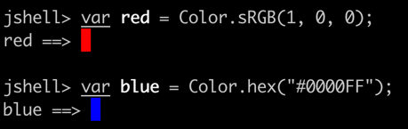
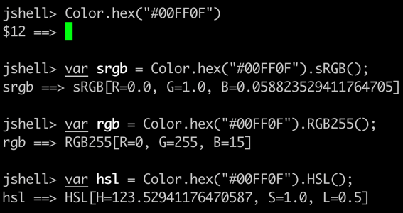
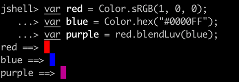
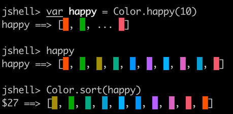

# color

Color library for the JVM.

Heavily based on [go-colorful](https://github.com/lucasb-eyer/go-colorful/tree/master)
by [Lucas Beyer](https://github.com/lucasb-eyer).


## Usage

You can create a color using one of the static factory methods on `Color`.

```java
var red = Color.sRGB(1, 0, 0);
var blue = Color.hex("#0000FF");
```



And you can get the components of a color in a particular color space using matching instance methods.

```java
// RGB in 0..1
var srgb = Color.hex("#00FF0F").sRGB();
// RBG in 0..255
var rgb = Color.hex("#00FF0F").RGB255();
// HSL
var hsl = Color.hex("#00FF0F").HSL();
```



To blend between different colors you can use the various blend methods.
These are tailored to blending in a particular color space.

```java
var red = Color.sRGB(1, 0, 0);
var blue = Color.hex("#0000FF");
var purple = red.blendLuv(blue);
```



There are also utilities for generating palettes of colors
and for sorting colors by their "distance" to each-other.

```java
var happy = Color.happy(10);
var sorted = Color.sort(happy);
```



